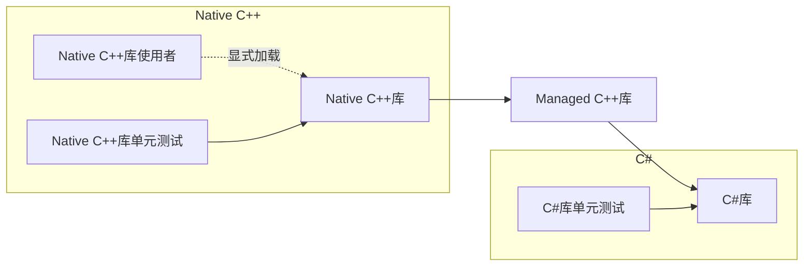

## 背景

因为业务的原因，需要从C++端调用一个C#库，设计的调用流程如下：


工程的组织如下：



动态库工程：

- Native C++库：生成`Unmanaged.lib`和`Unmanaged.dll`
- Managed C++库：生成`Wrapper.lib`和`Wrapper.dll`
- C#库：生成`Managed.dll`

可执行文件工程：

- Native C++库单元测试：生成`UnmanagedTest.exe`
- C#库单元测试：生成`ManagedTest.exe`
- Native C++库使用者：生成`LibConsumer.exe`。与单元测试工程不同的是，`LibConsumer.exe`会在运行期间调用`::LoadLibrary()`显示加载`Unmanaged.dll`，在链接期也不会链接到`Unmanaged.lib`和`Wrapper.lib`

现在情况如下：C#库编写完成，且C#库单元测试通过，但Native C++库单元测试未通过，`LibConsumer.exe`加载`Unmanaged.dll`也会失败（`::LoadLibrary()`返回句柄为`NULL`）。调试发现在托管C++层创建C#对象时会出现EEFileLoadException导致程序崩溃。


## EEFileLoadException

[Microsoft Docs](https://docs.microsoft.com/en-us/)没有找到对EEFileLoadException的描述，不过Stackoverflow上有个简要的回答，见[EEFileLoadException When Loading C++ DLL in Managed DLL](https://stackoverflow.com/questions/16796335/eefileloadexception-when-loading-c-dll-in-managed-dll/35319991)：

> An EEFileLoadException indicates the executable cannot find or load one of it's dependencies. That can of course has different causes (path problem, mixing configurations, mixing platforms).

即当可执行程序无法找到或加载它所依赖的动态库（更准确的说，是无法找到或加载**C# asseembly文件**，因为如果是VC的动态库，系统通常会报dll无法找到），程序会报EEFileLoadException。


## 为什么无法找到Assembly？

对于`ManagedTest.exe`，只需将`Unmanaged.dll`、`Wrapper.dll`、`Managed.dll`及`Managed.dll`自身依赖的Assembly复制到`ManagedTest.exe`同一目录下即可，这一点很好理解。

对于`LibConsumer.exe`，文件目录如下：

```bash
./LibConsumer.exe
./plugin/Unmanaged.dll
./plugin/Wrapper.dll
./plugin/Managed.dll
#./plugin/OtherAssembly.dll
#...
```

`Unmanaged.dll`及其依赖项均置于`plugin`目录下，`LibConsumer.exe`在运行时会使用`::LoadLibrary()`加载`./plugin/Unmanaged.dll`，为什么会出现加载失败？

这和Windows动态库的查找顺序有关。见[Standard Search Order for Desktop Applications](https://docs.microsoft.com/en-us/windows/win32/dlls/dynamic-link-library-search-order#standard-search-order-for-desktop-applications)：

> If **SafeDllSearchMode** is enabled, the search order is as follows:
>
> 1. The directory from which the application loaded.
> 2. The system directory. Use the [**GetSystemDirectory**](https://docs.microsoft.com/en-us/windows/desktop/api/sysinfoapi/nf-sysinfoapi-getsystemdirectorya) function to get the path of this directory.
> 3. The 16-bit system directory. There is no function that obtains the path of this directory, but it is searched.
> 4. The Windows directory. Use the [**GetWindowsDirectory**](https://docs.microsoft.com/en-us/windows/desktop/api/sysinfoapi/nf-sysinfoapi-getwindowsdirectorya) function to get the path of this directory.
> 5. The current directory.
> 6. The directories that are listed in the PATH environment variable. Note that this does not include the per-application path specified by the **App Paths** registry key. The **App Paths** key is not used when computing the DLL search path.
>
> If **SafeDllSearchMode** is disabled, the search order is as follows:
>
> 1. The directory from which the application loaded.
> 2. The current directory.
> 3. The system directory. Use the [**GetSystemDirectory**](https://docs.microsoft.com/en-us/windows/desktop/api/sysinfoapi/nf-sysinfoapi-getsystemdirectorya) function to get the path of this directory.
> 4. The 16-bit system directory. There is no function that obtains the path of this directory, but it is searched.
> 5. The Windows directory. Use the [**GetWindowsDirectory**](https://docs.microsoft.com/en-us/windows/desktop/api/sysinfoapi/nf-sysinfoapi-getwindowsdirectorya) function to get the path of this directory.
> 6. The directories that are listed in the PATH environment variable. Note that this does not include the per-application path specified by the **App Paths** registry key. The **App Paths** key is not used when computing the DLL search path.

`SafeDllSearchMode`默认是开启的，因此Windows会按以下顺序查找DLL：

1. 应用程序的加载路径（也就是`LibConsumer.exe`的加载路径）
2. system目录
3. 16位system目录
4. Windows目录
5. 用户当前目录
6. PATH环境变量里的目录

换而言之，`LibConsumer.exe`使用`::LoadLibrary()`加载`Unmanaged.dll`时，Windows并不会在`Unmanaged.dll`所在路径下查找`Wrapper.dll`等依赖项，而是直接从`LibConsumer.exe`所在路径下开始查找。因此，`Wrapper.dll`、`Managed.dll`等文件需要置于`LibConsumer.exe`同一目录下（或者用其余手段让Windows能够查找到它们）。